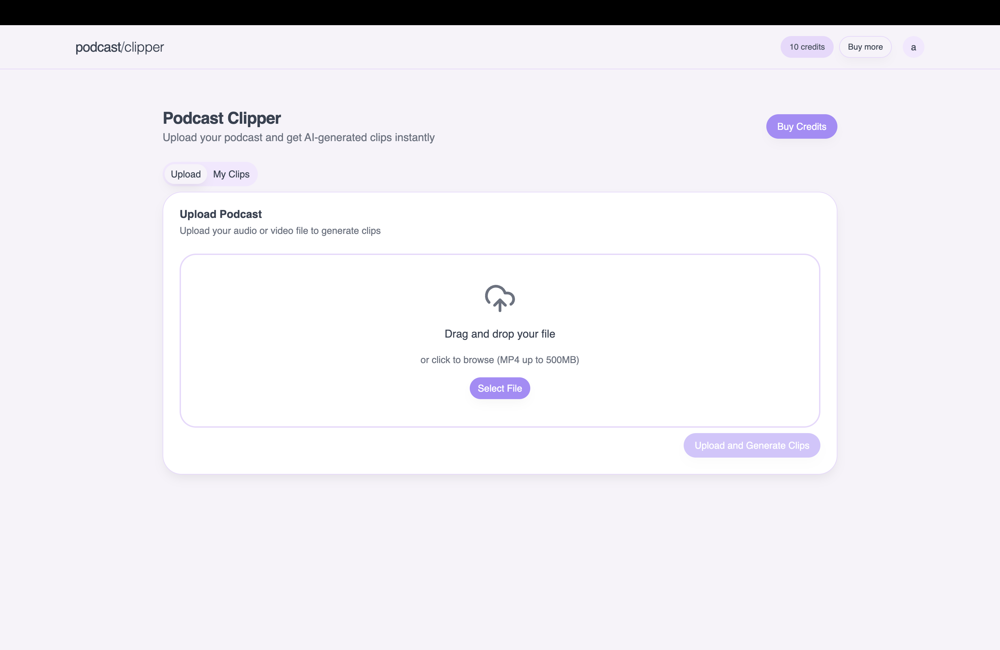

# 🎙️ AI Podcast Clipper SaaS

**Turn long-form podcast videos into viral short-form clips—fully automated with AI**

This is a SaaS platform that processes podcast videos using modern AI tools to generate engaging, vertical short-form clips suitable for platforms like **YouTube Shorts**, **TikTok**, and **Instagram Reels**. Features include auto-transcription, viral moment detection, speaker-focused cropping, and styled subtitles—all running serverlessly at scale.


-----


## 📺 Demo

Experience the AI Podcast Clipper SaaS live!

👉 **https://ai-podcast-clipper-frontend-khaki.vercel.app/signup**

Click on the image to see demo of Application
[](https://youtu.be/y0NS3Ic-mxA?si=EyfK10fpwoMue5nM)


---

## ✨ Features & Tech Behind Each

| Feature | Tools / Services Used |
|---|---|
| 🎼 Transcription | `WhisperX` (FastAPI + Python on Modal GPU) |
| 🧠 Viral Moment Detection | Google `Gemini 2.5 Pro` API |
| 🎯 Speaker Face Detection | `Junhua-Liao/LR-ASD` (Python on Modal) |
| 🎞️ Vertical Video Rendering | `FFMPEGCV`, `OpenCV` on Modal GPUs |
| 📃 Hardcoded Subtitles | Styled via ASS format inside FFMPEG |
| ✅ Authentication | Auth.js (NextAuth) with JWT sessions |
| 🔄 Background Processing | Event queues with Inngest |
| 📁 File Management | Uploads & fetch via `AWS S3` (presigned URLs) |
| 📊 User Dashboard | Built with Next.js 15 + Tailwind + Shadcn UI |

-----

## ⚙️ How It Works

1.  **User Uploads Podcast** from the web dashboard → uploaded directly to **S3** via presigned URL.
2.  **Inngest** event is triggered → starts background processing.
3.  **Modal** backend:
      - Transcribes audio
      - Identifies viral moments via Gemini
      - Crops to active speakers
      - Renders vertical clips with subtitles
4.  Completed clips saved to S3 → shown in dashboard for download.

-----

## 🛠 Project Stack

| Layer | Tech Stack |
|---|---|
| Frontend | Next.js 15, TypeScript, Tailwind, Shadcn |
| Backend | FastAPI (Python) on Modal |
| Queueing | Inngest (Event-driven orchestration) |
| Video AI | WhisperX, Gemini 2.5 Pro, LR-ASD, FFMPEG |
| Auth | Auth.js (NextAuth) |
| Storage | AWS S3 |

-----

## 📦 Local Dev Setup

### 1\. Clone Project

```bash
git clone https://github.com/avr-varshan/ai-podcast-clipper-saas.git
```

### 2\. Backend Setup (Modal + FastAPI)

```bash
cd ai-podcast-clipper-backend
pip install -r requirements.txt

# Clone face detection model
git clone https://github.com/Junhua-Liao/LR-ASD.git asd

# Run or deploy via Modal
modal setup
modal run main.py
modal deploy main.py
```

### 3\. Frontend Setup (Next.js + Vercel)

```bash
cd ai-podcast-clipper-frontend
npm install
npm run dev        # Local dev server
npm run inngest-dev  # Start Inngest queue locally
```

✅ Deploy frontend easily to Vercel with GitHub integration. Set up environment variables via the Vercel dashboard.

-----

### 🔐 Required Environment Variables

#### Frontend (Vercel)

```
NEXT_PUBLIC_AWS_REGION=
NEXT_PUBLIC_S3_BUCKET=
AUTH_SECRET=
NEXTAUTH_URL=
INNGEST_EVENT_KEY=
```

#### Backend (Modal)

```
AWS_ACCESS_KEY_ID=
AWS_SECRET_ACCESS_KEY=
S3_BUCKET_NAME=
GEMINI_API_KEY=
MODAL_TOKEN_SECRET=
```

-----

### ☁️ AWS S3 Setup

#### CORS Config

```json
[
  {
    "AllowedHeaders": ["*"],
    "AllowedMethods": ["PUT"],
    "AllowedOrigins": ["*"],
    "ExposeHeaders": ["ETag"]
  }
]
```

#### IAM Policy

```json
{
  "Version": "2012-10-17",
  "Statement": [
    {
      "Action": ["s3:ListBucket"],
      "Effect": "Allow",
      "Resource": "arn:aws:s3:::your-bucket-name"
    },
    {
      "Action": ["s3:GetObject", "s3:PutObject"],
      "Effect": "Allow",
      "Resource": "arn:aws:s3:::your-bucket-name/*"
    }
  ]
}
```

-----


### 🧑‍💻 Author

Made by Varshan A V R

-----

### 📄 License

MIT License – Free to use, modify, and scale.

```
```
